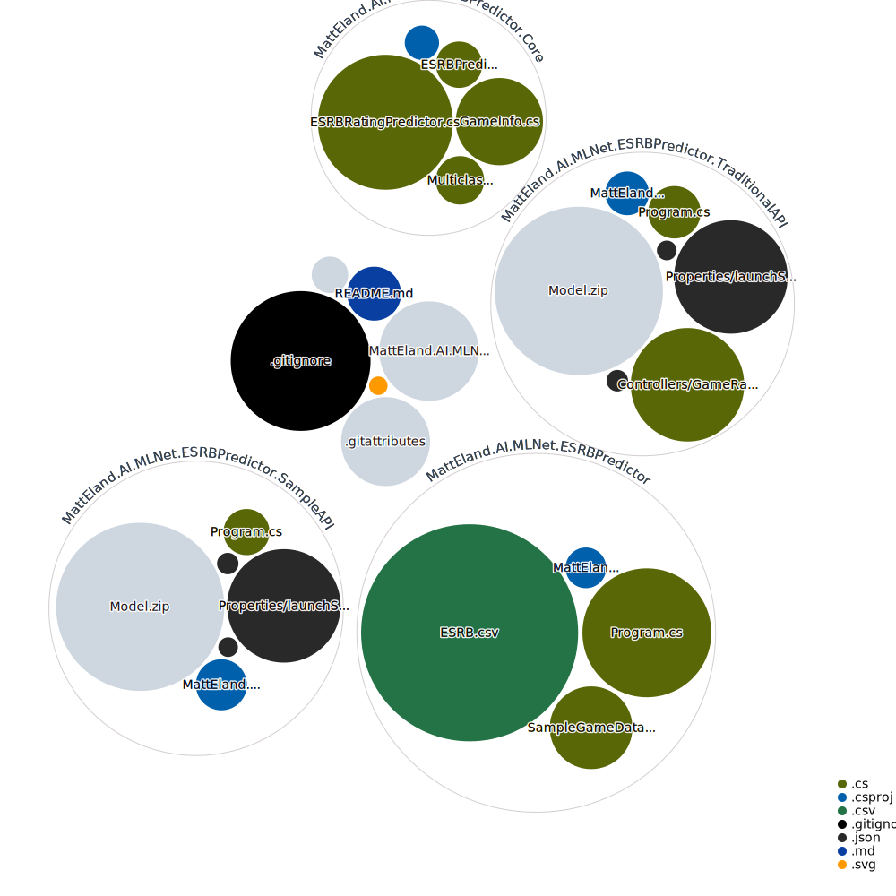

# Using ML.NET Auto ML to Classify Video Game ESRB Ratings

This is a .NET 6 Console Application that uses ML.NET's Auto ML to train a multi-class classification algorithm to predict the ESRB rating of video games based on the features of that game such as violence, drug or alcohol references, nudity, language, etc.

This repository is intended to support [an article I wrote](https://accessibleai.dev/post/ml_net-video-game-classification/)

Data for this project came from Mohammed Alhamad's [Video Game Rating by ESRB dataset](https://www.kaggle.com/imohtn/video-games-rating-by-esrb) on Kaggle. 

## Repository Visualization

[View interactive Diagram](https://octo-repo-visualization.vercel.app/?repo=integerman%2FML.NET-Auto-ML-ESRB-Rating-Classification)